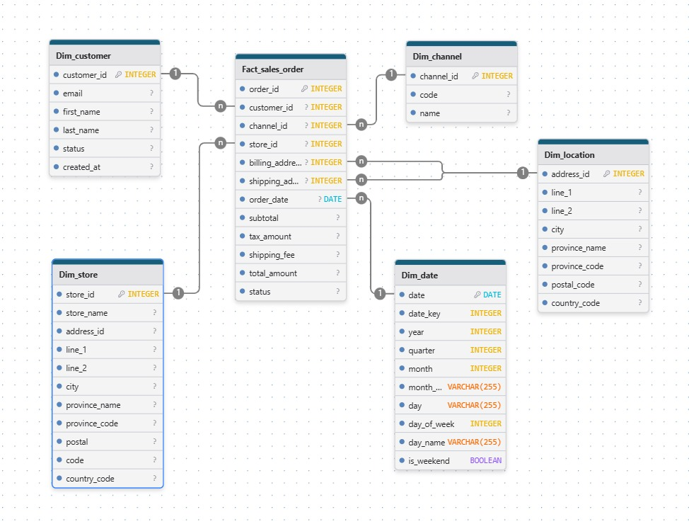
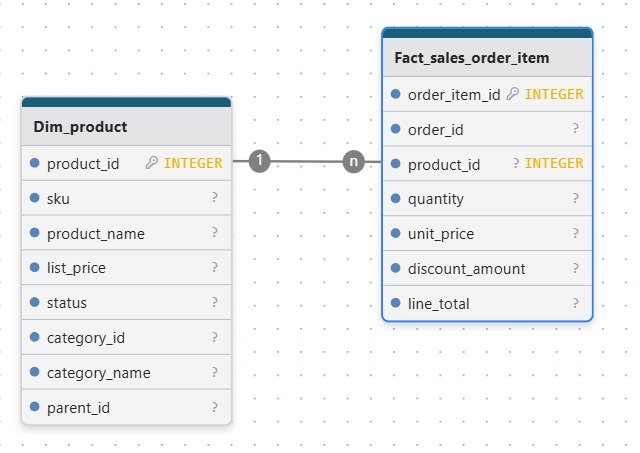
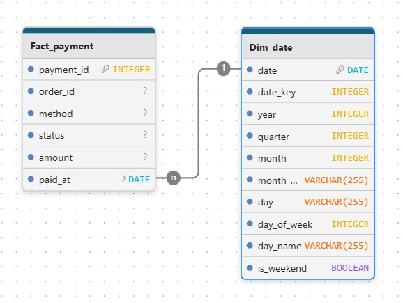
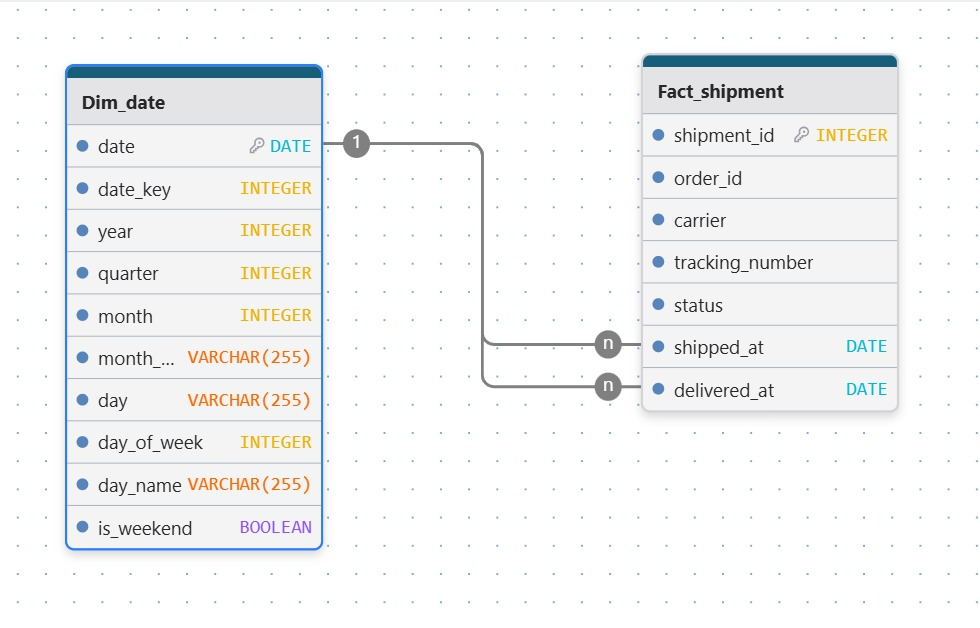
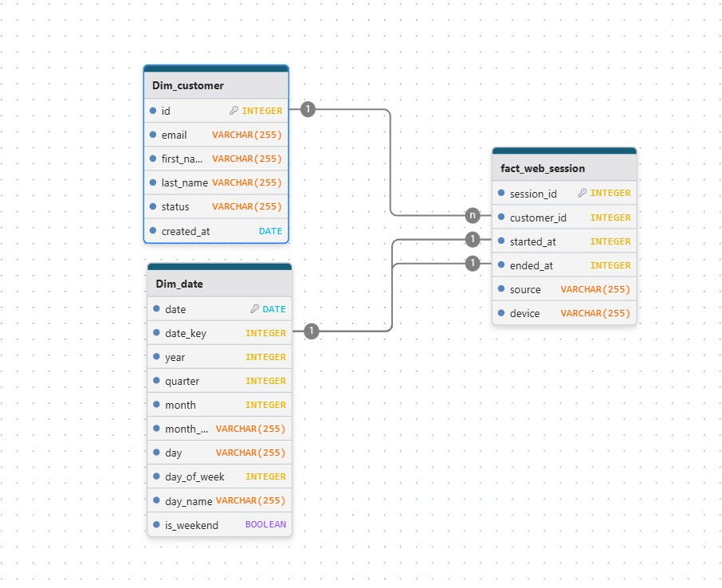
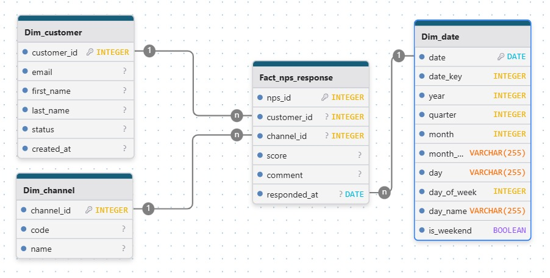

# Trabajo Práctico Final - Ecosistema de Datos (EcoBottle AR)

**Alumno:** Lucas Descalzo

Proyecto final de "Introducción al Marketing Online y los Negocios Digitales". El objetivo es implementar un pipeline de ETL (Extract, Transform, Load) que toma datos crudos de la empresa, los modela en una Constelación de Hechos (Esquema Estrella) y los carga en un Data Warehouse (carpeta `DW/`) listo para ser analizado y visualizado en PowerBI.

---

## 0. Contenidos

1.  [Descripción y Objetivos](#1-descripción-y-objetivos)
2.  [Modelo de Datos y Supuestos](#2-modelo-de-datos-y-supuestos)
3.  [Diagramas del Esquema (Constelación de Hechos)](#3-diagramas-del-esquema-constelación-de-hechos)
4.  [Diccionario de Datos (Data Warehouse)](#4-diccionario-de-datos-data-warehouse)
5.  [Estructura del Repositorio y Pipeline](#5-estructura-del-repositorio-y-pipeline)
6.  [Instrucciones de Ejecución](#6-instrucciones-de-ejecución)
7.  [KPIs del Dashboard](#7-kpis-del-dashboard)

---

## 1. Descripción y Objetivos

Este proyecto implementa un data warehouse (DW) liviano en formato CSV a partir de datos RAW provistos. El pipeline de ETL genera un modelo dimensional "puro" (Esquema Estrella) siguiendo las mejores prácticas de Kimball.

El entregable final son las 13 tablas (`dim_` y `fact_`) en la carpeta `DW/`, listas para construir el dashboard de KPIs en PowerBI: **Ventas**, **Usuarios Activos**, **Ticket Promedio**, **NPS**, **Ventas por Provincia** y **Ranking Mensual por Producto**.

---

## 2. Modelo de Datos y Supuestos

Se diseñó una **Constelación de Hechos** (múltiples esquemas estrella) donde las dimensiones comunes (ej. `dim_date`, `dim_customer`) son "conformadas" y compartidas por múltiples tablas de hechos.

**Supuestos y Decisiones de Modelado:**

* **Claves (Keys):**
    * Se utilizan las **Claves de Negocio (Business Keys)** originales (ej. `customer_id`, `product_id`) como claves primarias en las dimensiones. Esto simplifica el modelo y mantiene la trazabilidad con los datos RAW, cumpliendo con los requisitos del proyecto. No se generaron *Surrogate Keys* (`_sk`).
* **Dimensión de Tiempo (`dim_date`):**
    * Esta es una **dimensión de conformación generada** por el script de ETL, ya que no existe en los datos RAW.
    * Todas las tablas de hechos se vinculan a esta dimensión a través de sus respectivos campos de fecha (ej: `order_date`, `responded_at`).
* **Denormalización en Dimensiones:**
    * **`dim_product`**: Se denormaliza uniendo `product` con `product_category` para incluir el nombre de la categoría en la misma fila.
    * **`dim_location`**: Se denormaliza uniendo `address` con `province` para tener la información de provincia directamente en la dimensión geográfica.
* **Dimensiones de Rol (Role-Playing):**
    * **`dim_location`** es utilizada en dos roles en `fact_sales_order`: `shipping_address_id` (envío) y `billing_address_id` (facturación).
    * **`dim_date`** es utilizada en múltiples roles en `fact_shipment`: `shipped_at` (despacho) y `delivered_at` (entrega).

---

## 3. Diagramas del Esquema (Constelación de Hechos)

Los siguientes diagramas (generados en `drawDB` y guardados en `esquema_estrella/`) ilustran las relaciones entre las tablas de hechos y sus dimensiones.

### A. Constelación de Ventas (Pedidos, Items, Pagos y Envíos)





### B. Esquema de Sesiones Web (Usuarios Activos)


### C. Esquema de NPS


---

## 4. Diccionario de Datos (Data Warehouse)

El pipeline genera las siguientes 13 tablas en la carpeta `DW/`.

### A. Dimensiones (Tablas Descriptivas)
* **`dim_customer`**: Maestro de clientes.
* **`dim_product`**: Maestro de productos y sus categorías.
* **`dim_location`**: Maestro de direcciones y sus provincias.
* **`dim_store`**: Maestro de tiendas físicas y sus direcciones.
* **`dim_channel`**: Catálogo de canales de venta (Online, Offline).
* **`dim_province`**: Catálogo de provincias.
* **`dim_date`**: Dimensión de calendario generada automáticamente (Día, Mes, Año, Trimestre, etc.).

### B. Hechos (Tablas Transaccionales)

#### 1. `fact_sales_order`
* **Descripción:** Cabeceras de las órdenes de venta. Fuente para KPIs de Ventas y Ticket Promedio.
* **Grano:** Una fila por cada orden (`sales_order`).
* **Dimensiones (FKs):** `dim_customer`, `dim_channel`, `dim_store`, `dim_date` (por `order_date`), `dim_location` (x2: envío y facturación).
* **Medidas:** `subtotal`, `tax_amount`, `shipping_fee`, `total_amount`.

#### 2. `fact_sales_order_item`
* **Descripción:** Detalle de productos en cada orden. Fuente para el Ranking de Productos.
* **Grano:** Una fila por cada ítem de producto dentro de una orden (`sales_order_item`).
* **Dimensiones (FKs):** `fact_sales_order` (por `order_id`), `dim_product`.
* **Medidas:** `quantity`, `unit_price`, `discount_amount`, `line_total`.

#### 3. `fact_payment`
* **Descripción:** Registra las transacciones de pago asociadas a las órdenes.
* **Grano:** Una fila por cada transacción de pago (`payment`).
* **Dimensiones (FKs):** `fact_sales_order` (por `order_id`), `dim_date` (por `paid_at`).
* **Medidas:** `amount`.

#### 4. `fact_shipment`
* **Descripción:** Registra la información logística de los envíos.
* **Grano:** Una fila por envío (`shipment`).
* **Dimensiones (FKs):** `fact_sales_order` (por `order_id`), `dim_date` (x2: `shipped_at` y `delivered_at`).
* **Medidas:** (Ninguna medida directa, se usa para calcular tiempos de entrega).

#### 5. `fact_web_session`
* **Descripción:** Sesiones de navegación web. Fuente para el KPI de Usuarios Activos.
* **Grano:** Una fila por sesión web (`web_session`).
* **Dimensiones (FKs):** `dim_customer` (puede ser NULO), `dim_date` (por `started_at` y `ended_at`).
* **Medidas:** (Ninguna medida directa, se usa para `COUNT(DISTINCT user_key)`).

#### 6. `fact_nps_response`
* **Descripción:** Respuestas a las encuestas de Net Promoter Score (NPS).
* **Grano:** Una fila por cada respuesta de encuesta (`nps_response`).
* **Dimensiones (FKs):** `dim_customer` (puede ser NULO), `dim_channel`, `dim_date` (por `responded_at`).
* **Medidas:** `score`.


---

## 5. Estructura del Repositorio y Pipeline

El proyecto sigue una arquitectura E-T-L (Extract, Transform, Load) modular, orquestada por `main.py`.

```
.
├── README.md
├── requirements.txt
├── .gitignore
├── main.py               # (Orquestador E-T-L)
│
├── scripts/              # (Módulos del Pipeline)
│   ├── extract.py        # (Fase E: Lee CSVs de /raw)
│   ├── transform.py      # (Fase T: Cerebro. Aplica lógica y crea Dims/Facts)
│   └── load.py           # (Fase L: Guarda Dims/Facts en /DW)
│
├── raw/                  # (Datos fuente - SOLO LECTURA)
│   └── *.csv
│
├── DW/                   # (Data Warehouse - DATOS GENERADOS)
│   ├── dim_*.csv
│   └── fact_*.csv
│
├── esquema_estrella/     # (Diagramas del Modelo)
│   └── *.jpeg
│
└── venv/                 # (Entorno virtual - Ignorado por Git)
```


## 6. Instrucciones de Ejecución

Para ejecutar este proyecto y (re)generar el Data Warehouse en tu máquina local:

1.  **Clonar el repositorio:**
    ```bash
    git clone [https://github.com/Lucas-Descalzo/mkt_tp_final.git](https://github.com/Lucas-Descalzo/mkt_tp_final.git)
    cd mkt_tp_final
    ```

2.  **Crear y activar un entorno virtual:**
    ```bash
    # Crear el entorno
    python -m venv venv

    # Activar en Windows (Command Prompt)
    .\venv\Scripts\activate
    ```

3.  **Instalar las dependencias:**
    ```bash
    pip install -r requirements.txt
    ```

4.  **Ejecutar el Pipeline ETL:**
    *Asegúrate de que la carpeta `raw/` contenga los 13 CSVs.*
    ```bash
    python main.py
    ```

Tras la ejecución (aprox. 3-5 segundos), la carpeta `DW/` contendrá las 13 tablas del Esquema Estrella en formato `.csv`, listas para ser consumidas por PowerBI.

---

## 7. KPIs del Dashboard

Los archivos `.csv` generados en `DW/` son la fuente de datos para el dashboard en **PowerBI**. El modelo de datos (relacionando las tablas `dim_` y `fact_` dentro de PowerBI) permite calcular los siguientes KPIs:

* **Ventas Totales ($M)**
* **Usuarios Activos (nK)**
* **Ticket Promedio ($K)**
* **NPS (ptos.)**
* **Ventas por Provincia**
* **Ranking Mensual por Producto**